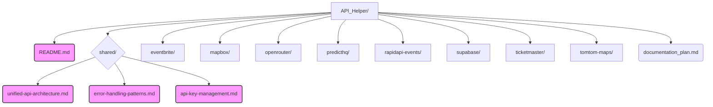

# Foundational API Documentation Creation Plan

**Overall Goal:** Establish a clear, consistent, and maintainable API documentation strategy for the NEWEVENTS project by creating essential foundational documents.

**Proposed Document Structure:**

*(New files to be created are highlighted)*

---

## Detailed Content Outlines:

### 1. `API_Helper/README.md`

*   **Purpose:** To provide an overview of the API documentation strategy for the NEWEVENTS project, explain the purpose of the `API_Helper/` directory, and guide developers on how to use and contribute to the API documentation.
*   **Outline:**
    *   **Introduction**
        *   Brief overview of the NEWEVENTS project's reliance on external APIs.
        *   Purpose of this `API_Helper` directory: Centralized hub for all API-related documentation, guides, and best practices.
    *   **Documentation Strategy**
        *   Philosophy: Clear, concise, consistent, and actionable documentation.
        *   Goals:
            *   Facilitate smooth API integration.
            *   Ensure maintainability and scalability of API clients.
            *   Promote best practices in API usage (security, error handling, performance).
            *   Reduce onboarding time for new developers.
    *   **Directory Structure**
        *   Explanation of `API_Helper/`: Contains general API documentation and specific guides for each integrated API.
        *   Explanation of `API_Helper/shared/`: Contains foundational documents applicable across multiple APIs (e.g., architecture, error handling, security).
        *   Explanation of `API_Helper/<api_name>/`: Contains specific implementation guides, endpoint details, and examples for individual APIs.
    *   **How to Use This Documentation**
        *   For understanding overall API strategy: Refer to `README.md` and documents in `shared/`.
        *   For integrating a specific API: Refer to the relevant guide in `API_Helper/<api_name>/`.
    *   **Contributing to API Documentation**
        *   Guidelines for adding new API documentation.
        *   Process for updating existing documentation.
        *   Style guide (if any, or link to a general project style guide).
        *   Importance of keeping documentation up-to-date with code changes.
    *   **Key Foundational Documents (Links)**
        *   Link to `shared/unified-api-architecture.md`
        *   Link to `shared/error-handling-patterns.md`
        *   Link to `shared/api-key-management.md` (once created)
    *   **Contact/Support**
        *   Who to contact for questions or clarifications regarding API integrations.

---

### 2. `API_Helper/shared/unified-api-architecture.md`

*   **Purpose:** To define a consistent architectural approach for integrating various third-party APIs, ensuring modularity, maintainability, and scalability.
*   **Outline:**
    *   **Introduction**
        *   Importance of a unified architecture for managing multiple API integrations.
        *   Goals: Consistency, reusability, simplified maintenance, improved testability.
    *   **Core Architectural Principles**
        *   Abstraction: Decouple application logic from specific API client implementations.
        *   Modularity: Each API integration should be a self-contained module.
        *   Configuration-driven: API keys, endpoints, and other settings should be configurable.
    *   **Standardized Request/Response Handling**
        *   Common request building patterns (e.g., headers, authentication).
        *   Generic response parsing and validation.
        *   Consistent data structures for API responses within the application.
    *   **Data Transformation Layers**
        *   Purpose: To map external API data models to internal application data models.
        *   Strategies for implementing transformation (e.g., dedicated mapper functions/classes).
        *   Benefits: Isolates application from changes in external API schemas.
    *   **Client-Side vs. Server-Side API Calls**
        *   Criteria for deciding where to make API calls (security, rate limits, data sensitivity, user experience).
        *   Best practices for server-side calls (e.g., using dedicated API routes/services).
        *   Considerations for client-side calls (e.g., CORS, exposing sensitive information).
        *   Hybrid approaches.
    *   **Caching Strategies for API Responses**
        *   Identifying cacheable API endpoints.
        *   Cache duration and invalidation strategies.
        *   Recommended caching mechanisms (e.g., server-side cache, client-side cache, CDN).
        *   Impact on rate limits and performance.
    *   **API Client Implementation Guidelines**
        *   Structure of an API client module (e.g., service class, utility functions).
        *   Use of environment variables for API keys and base URLs.
        *   Logging within API clients.
        *   Unit and integration testing for API clients.
    *   **Versioning**
        *   Handling different versions of external APIs.
        *   Strategies for versioning internal API client modules.
    *   **Example (Conceptual)**
        *   A high-level diagram or pseudo-code illustrating the flow of an API call through the unified architecture.

---

### 3. `API_Helper/shared/error-handling-patterns.md`

*   **Purpose:** To establish standardized patterns for handling errors from various APIs, ensuring consistent error reporting, logging, and user experience.
*   **Outline:**
    *   **Introduction**
        *   The inevitability of API errors and the need for robust handling.
        *   Goals: Consistent error classification, effective logging, graceful degradation, informative user feedback.
    *   **Common API Error Types**
        *   Network errors (e.g., timeouts, DNS issues).
        *   Authentication/Authorization errors (e.g., 401, 403).
        *   Rate limit errors (e.g., 429).
        *   Server-side errors from the API provider (e.g., 5xx).
        *   Validation errors/Bad requests (e.g., 400).
        *   Not found errors (e.g., 404).
    *   **Standardized Error Object/Structure**
        *   Defining a common internal error object to represent API errors within the application.
        *   Fields to include (e.g., original error, status code, user-friendly message, internal error code).
    *   **Mapping External API Errors to Internal Errors**
        *   Strategies for translating diverse error responses from different APIs into the standardized internal error structure.
        *   Importance of preserving original error details for debugging.
    *   **Logging Strategies for API Errors**
        *   What to log: Timestamp, API endpoint, request parameters (sensitive data redacted), error details, stack trace.
        *   Log levels for different error types.
        *   Tools and services for centralized logging.
    *   **User-Facing Error Messages**
        *   Guidelines for crafting clear, concise, and helpful error messages for users.
        *   Avoiding technical jargon.
        *   Providing actionable advice or recovery options where possible.
        *   Localization considerations.
    *   **Retry Mechanisms and Backoff Strategies**
        *   Identifying transient errors eligible for retries (e.g., network glitches, rate limits).
        *   Implementing exponential backoff with jitter.
        *   Maximum retry attempts.
        *   Circuit breaker pattern considerations.
    *   **Error Monitoring and Alerting**
        *   Setting up alerts for critical API errors or high error rates.
        *   Tools for error tracking and analysis.
    *   **Specific API Error Handling Notes (Links or Sections)**
        *   Pointers to specific error handling nuances for key integrated APIs, if any.

---

### 4. API Key Management Guide (Proposed Outline for `API_Helper/shared/api-key-management.md`)

*   **Purpose:** To provide a central guide on how API keys/secrets should be securely managed within the NEWEVENTS project.
*   **Outline:**
    *   **Introduction**
        *   Importance of secure API key management.
        *   Risks associated with compromised API keys.
    *   **Principles of Secure API Key Management**
        *   Least privilege: Keys should only have necessary permissions.
        *   Regular rotation: Periodically change API keys.
        *   Secure storage: Never hardcode keys in source code.
        *   Restricted access: Limit who can access API keys.
        *   Monitoring: Track API key usage for suspicious activity.
    *   **Recommended Storage Mechanisms**
        *   **Environment Variables:**
            *   How to use them for local development (`.env.local`, etc.).
            *   How to configure them in deployment environments (Vercel, Netlify, Docker, etc.).
            *   Security considerations (e.g., not committing `.env` files).
        *   **Secrets Management Services (e.g., HashiCorp Vault, AWS Secrets Manager, Google Secret Manager, Vercel Environment Variables UI)**
            *   Overview of available options relevant to the project's stack.
            *   Benefits (centralization, access control, audit logs).
            *   Basic setup and usage guidelines.
    *   **Access Control for API Keys**
        *   Restricting API key usage by IP address, HTTP referrer, or other methods if supported by the API provider.
    *   **API Key Usage in Code**
        *   How to securely load and use API keys from environment variables or secrets managers in the application code (client-side vs. server-side considerations).
        *   Avoiding accidental exposure of keys in client-side code.
    *   **API Key Rotation Policy**
        *   Recommended frequency for key rotation.
        *   Procedure for rotating keys with minimal service disruption.
    *   **Auditing and Monitoring**
        *   How to monitor API key usage.
        *   What to do in case of a suspected key compromise.
    *   **Responsibilities**
        *   Who is responsible for managing and rotating API keys.