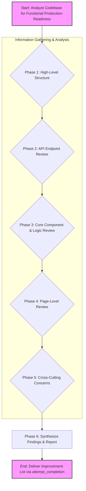

# Plan: Functional Production-Readiness Code Review

## 1. Overall Goal
To analyze the existing codebase and identify specific, actionable improvements to enhance its functional production-readiness. This review will focus on the application code's functionality, robustness, scalability, error handling, performance, user experience (from a code perspective), and general code quality/maintainability. Security aspects are explicitly out of scope for this review.

## 2. Scope of Review
The review will cover the following aspects of the codebase:

*   **Functionality:** Identify missing features, logical bugs, or incorrect behaviors evident from the code.
*   **Robustness:** Assess how well the application code handles unexpected inputs, edge cases, or states.
*   **Scalability:** Look for architectural patterns, data structures, or algorithms that might hinder scaling.
*   **Error Handling (in Code):** Review general error handling mechanisms within the application code (e.g., try-catch blocks, error propagation, global error handlers).
*   **Performance (in Code):** Identify potential bottlenecks or areas where code performance could be optimized.
*   **User Experience (UX) from Code Perspective:** Suggest code improvements that could lead to a more intuitive, responsive, or user-friendly application.
*   **Code Quality & Maintainability:** Identify code smells, lack of clarity, poor modularity, or insufficient comments that impact functional robustness.

## 3. Review Process & Methodology

The review will be conducted in several phases:

### Phase 1: High-Level Structure & Key File Identification
*   **Objective:** Understand the overall project structure and identify key areas for deeper review.
*   **Actions:**
    *   List files in primary directories: `app/`, `components/`, `hooks/`, `lib/`, `pages/` (if it exists and is used), `styles/`, `types/`.
    *   Use `list_code_definition_names` on potentially complex or central files/directories identified from the file listing to get a quick overview of their contents.
*   **Key Directories to Examine:**
    *   `app/`: Core application structure, routing, API endpoints.
    *   `components/`: Reusable UI components.
    *   `hooks/`: Custom React hooks for state management and logic.
    *   `lib/`: Utility functions, API clients, service integrations, core business logic.
    *   `pages/`: (If Next.js Pages Router is used alongside App Router) Page components.
    *   `styles/`: Global styles and theming.
    *   `types/`: TypeScript type definitions.

### Phase 2: API Endpoint Review
*   **Objective:** Analyze the backend logic, data handling, and error management of core API endpoints.
*   **Focus:** Primarily on core production API routes (e.g., [`app/api/events/route.ts`](app/api/events/route.ts:0), [`app/api/auth/session/route.ts`](app/api/auth/session/route.ts:0), and other non-test specific endpoints). `test-*` routes will be largely excluded unless a specific pattern in a core route warrants comparison.
*   **Actions:**
    *   Read the content of selected core API route files.
    *   Analyze for:
        *   Input validation and sanitization.
        *   Comprehensive error handling and appropriate HTTP status codes.
        *   Clear and efficient business logic.
        *   Data transformation and response structuring.
        *   Potential performance bottlenecks (e.g., N+1 query patterns if database interactions are visible).

### Phase 3: Core Component & Logic Review
*   **Objective:** Examine the functionality, state management, and robustness of key UI components and shared business logic.
*   **Focus:**
    *   Complex or critical components identified in `components/`.
    *   Core custom hooks in `hooks/` (e.g., for data fetching, state management).
    *   Key utility modules and service integrations in `lib/`.
*   **Actions:**
    *   Read the content of selected files.
    *   Analyze for:
        *   Proper state management and data flow.
        *   Effective prop handling and component composition.
        *   Management of side effects.
        *   Clarity and efficiency of utility functions.
        *   Robustness of business logic implementation.

### Phase 4: Page-Level Review (Frontend)
*   **Objective:** Assess how pages integrate components, manage data, and handle user interactions.
*   **Focus:** Key user-facing pages within the `app/` directory (e.g., [`app/page.tsx`](app/page.tsx:0), [`app/events/page.tsx`](app/events/page.tsx:0)).
*   **Actions:**
    *   Read the content of selected page files.
    *   Analyze for:
        *   Efficient data fetching strategies (client-side vs. server-side).
        *   Clarity of rendering logic.
        *   Handling of user interactions and events.
        *   Management of loading and error states from a UX perspective.

### Phase 5: Cross-Cutting Concerns Review
*   **Objective:** Identify patterns and practices related to error handling, performance, and scalability across the codebase.
*   **Actions:**
    *   **Error Handling:**
        *   Search for common error handling patterns (e.g., `try...catch`, global error handlers, logging mechanisms) using `search_files`.
        *   Assess if errors are caught, logged, and handled gracefully.
    *   **Performance:**
        *   During individual file reviews (Phases 2-4), look for obvious performance anti-patterns (e.g., inefficient loops, redundant computations, lack of memoization where beneficial).
    *   **Scalability:**
        *   During individual file reviews, note any architectural choices or code patterns that might impede future scaling (e.g., tight coupling, inefficient data processing).

### Phase 6: Synthesize Findings & Reporting
*   **Objective:** Consolidate all observations and prepare a list of actionable improvement suggestions.
*   **Actions:**
    *   Compile all identified issues and potential improvements from Phases 1-5.
    *   Prioritize suggestions based on their potential impact on production-readiness.
    *   Formulate a clear, bulleted list of actionable recommendations, referencing specific files or code sections where possible.
    *   Use the `attempt_completion` tool with this list as the result.

## 4. Tools to be Utilized
*   `list_files`: To explore directory structures.
*   `list_code_definition_names`: For a quick overview of file contents.
*   `read_file`: To examine the content of specific files.
*   `search_files`: To find specific patterns related to error handling or other cross-cutting concerns.
*   `attempt_completion`: To deliver the final list of recommendations.

## 5. Diagram: Review Flow

This plan will guide the systematic review of the codebase to identify functional improvements for production readiness.